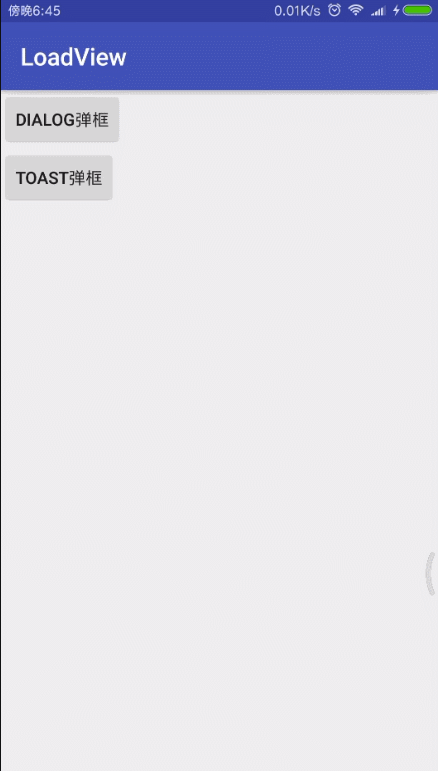

# LoadingView
各种弹框。

**gif：**




### 两种实现模式：

一、采用Dialog模式实现：

缺点：必须得依赖Activity页面，所以很难用单例模式来生成，因为会造成内存泄漏。

优点：dialog本来就是为这个而生的，比较简单。


二、采用Toast模式实现：

缺点：无法像dialog一样能获取焦点，屏蔽其他控件事件。(比如正在加载网络请求时，页面其他控件是不能点击 

​            的，但是toast无法屏蔽事件)

优点：不依赖Activity，只需要Application即可。


duration时间问题。因为toast时间系统设置为固定的2秒和3.5秒。

使用toast需要解决两个问题：

①当duration不是2或者3.5秒时，怎么解决；

②当duration不确定时，怎么解决，比如正在进行网络请求；

**解决方案：主要是利用了CountDownTimer类。Android自带的倒计时控件。**


##### **小技巧**：

* progressbar 更改颜色在xml中添加两句代码

```
android:indeterminateTint="#7f7f7f"
android:indeterminateTintMode="src_atop"
```

* dialog自定义contentView。LoadingDialog类是Dialog的包装类。

* 自定义GraduallyTextView实现加载文字跟着high起来的幻觉。借鉴的http://www.jianshu.com/p/f8a9cfb729f9

  主要是利用了drawText和透明度这两个技术点。


